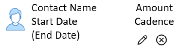
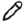

# Recurring Payments

Set up a recurring payment plan using the same secure payment method you know and trust.

The [product name] ensures that you can track all your past and future payments using the [name of app] or [product ui].

Recurring payments can support payment to a single or multiple contacts.

Specify the payment methods by:

* Contact(s)
* Frequency of the payment over a period of time (weekly, monthly, etc.)
* Duration of the payments (up to a specified date, or unlimited).
* Amount

You can modify or cancel recurring payments at any time.

## Prerequisites

1. A registered [product name] account
1. Account permission to access the payment history list
1. Customer details are configured

>Note: If you use REST APIs, see [Recurring Payment REST API](p2p-api.md).

## Configure recurring payments

1. Log in to your [product name] account home screen.
1. Go to contacts.
1. CLick the contact name and select **Recurring Payment**.
1. Add the payment **Frequency** - how often the payment is automatically transferred to the selected contact.
1. Enter the **Duration**- Date of which to end the automatic payment. You can select **Unlimited** for continued automatic payments.
1. Enter the payment **Amount** in USD. Value must be greater than 1.00.

Result: Once you save your contact's recurring payment details, the payments are automatically transferred to your contact. 

Repeat this process for any additional contacts that require recurring payments.

## Manage recurring payments

Once your have at least one contact with a recurring payment, the tab **Recurrent Payment** will appear on 
your home screen. From here, you can modify or cancel the recurring payment.

**Contact details include:**

* Cadence - Frequency of payments
* Start Date* 
* End Date (if applicable)
* Amount

* The contact list is sorted in ascending order by Start Date.

### Modify recurring payment

 

Click the writing tool in the contact details. This will open the recurring payment settings allowing you to make required changes.

Result: The recurring payment is immediately updated once you save your changes.

### Cancel recurring payment

 

Click the cancel icon in the contact details. 

Result: Automatic recurring payments to that contact are immediately cancelled.

